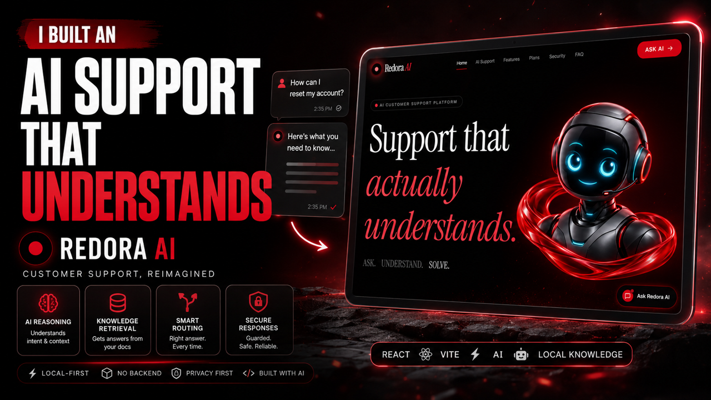
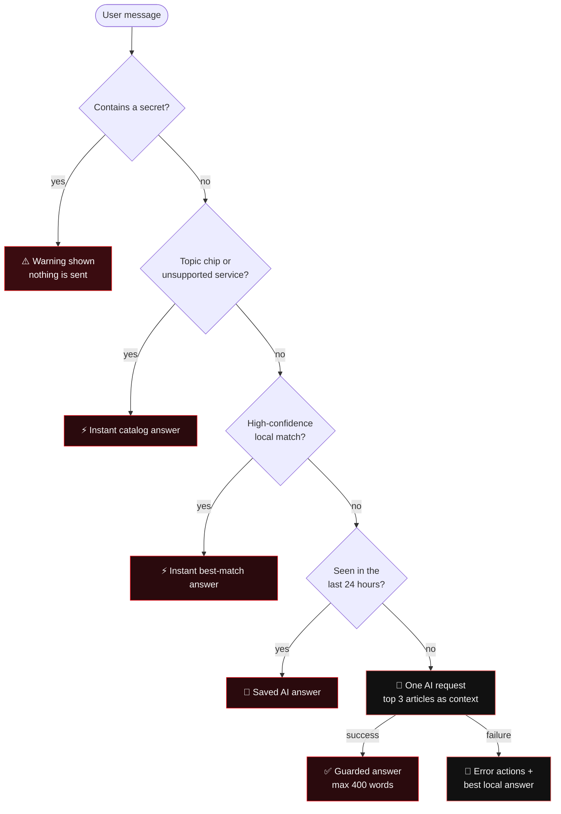
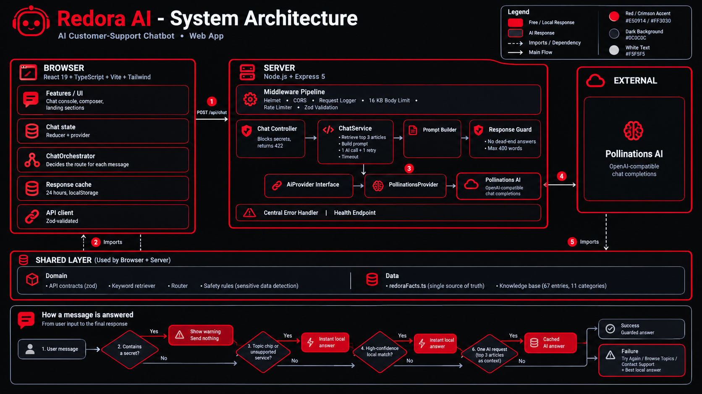

<div align="center">



<br/>

<a href="https://github.com/CraftxCode/Redora_AI">
  
</a>

<br/>


<br/>


<br/><br/>

<a href="#-watch-the-video"><b>Video</b></a> &nbsp;•&nbsp;
<a href="#-quick-start"><b>Quick start</b></a> &nbsp;•&nbsp;
<a href="#-how-a-message-is-answered"><b>How it works</b></a> &nbsp;•&nbsp;
<a href="#-architecture"><b>Architecture</b></a> &nbsp;•&nbsp;
<a href="#-testing"><b>Tests</b></a> &nbsp;•&nbsp;
<a href="#-author"><b>Author</b></a>

</div>


## 🎬 Watch the video

<div align="center">

<a href="https://youtu.be/ckty7wyxhMA" title="Watch the Redora AI walkthrough on YouTube">
  
</a>

<br/>

<a href="https://youtu.be/ckty7wyxhMA"></a>

</div>


## 🔴 About

**Redora AI** is a premium, responsive AI customer-support web app with a cinematic **black and crimson** interface and a support assistant that is genuinely useful.

It is a portfolio and educational project for **Redora**, a **fictional** digital-workspace platform. Every plan, price, policy, email and URL is **DEMO data**. The assistant, the code and the architecture are real.

<table>
<tr>
<td width="62%" valign="top">

**The idea:** most support bots either call an AI for everything (slow and costly) or follow rigid scripts (frustrating). Redora AI does both well:

- Common questions are answered **instantly** from a local knowledge base.
- Open-ended questions go to the AI, with **only the few relevant articles** as context.
- It **never leaves the user without help**. If the AI is down, you still get the best local answer plus clear next steps.

</td>
<td width="38%" align="center">

</td>
</tr>
</table>


## ✨ Highlights

| | Feature | What it means |
|:-:|---|---|
| ⚡ | **Local-first answers** | Plans, password reset, billing, security and contact questions never use an AI request |
| 🧠 | **Smart routing** | A pure router sends short, confident questions to the knowledge base and conversational ones to the AI |
| 🛡️ | **Secure by design** | Passwords, OTPs, card numbers, CVVs and API secrets are detected, redacted and never sent |
| 🔁 | **Resilient** | One AI request per message, a timeout, one retry for transient errors, and a rate limiter |
| 🧯 | **Graceful failure** | Clear error message with **Try Again**, **Browse Support Topics** and **Contact Support** |
| 🚫 | **No dead ends** | A response guard replaces any "I don't know" reply with guidance and a next step |
| 🎞️ | **Cinematic motion** | GSAP and ScrollTrigger: split-text reveals, horizontal storytelling, parallax and magnetic buttons |
| ♿ | **Accessible** | Keyboard navigation, ARIA live chat log, visible focus and `prefers-reduced-motion` support |
| 🧪 | **Tested** | 39 automated tests for retrieval, routing, safety, the orchestrator, cache and the API |


## 🧭 How a message is answered

Each message passes a few gates in order. It only moves down if nothing above could answer it, and each gate is cheaper than the one below.



> Four of the five outcomes use **no new AI request**. That is how the project stays fast and free-tier friendly.


## 🧰 Tech stack

| Layer | Technology |
|---|---|
| **Frontend** | React 19, TypeScript (strict), Vite, Tailwind CSS 3, Lucide React |
| **Motion** | GSAP and ScrollTrigger, with CSS for the background (no canvas or 3D engine) |
| **Backend** | Node.js, Express 5, Helmet, Zod |
| **AI** | Pollinations (OpenAI-compatible chat completions), called only from the server |
| **Knowledge** | Local structured knowledge base with keyword retrieval (no vector database) |
| **Quality** | Vitest, strict TypeScript across client, server and tooling |


## 🚀 Quick start

**Requirements:** Node.js 20 or newer.

```bash
git clone https://github.com/CraftxCode/Redora_AI.git
cd Redora_AI
npm install
npm run dev
```

Then open **http://localhost:5173**. The API runs on `http://localhost:8787`.

The app works **without any API key**: common questions are answered locally, and the Pollinations anonymous tier is used for open-ended ones.

### 🔑 Add your Pollinations key (optional, recommended)

1. Create a **secret (server-side)** key at [enter.pollinations.ai](https://enter.pollinations.ai).
2. Copy the example file and edit it:

   ```bash
   cp .env.example .env        # Windows: copy .env.example .env
   ```

   ```env
   POLLINATIONS_API_KEY=your_secret_key_here
   POLLINATIONS_MODEL=openai
   POLLINATIONS_API_URL=https://gen.pollinations.ai/v1/chat/completions
   ```
3. Restart `npm run dev`, then open `http://localhost:8787/api/health`. You should see `"keyConfigured": true`.

> 🔒 The key lives only in the server's environment. It is never bundled into the React app and never logged.

### 📜 Scripts

| Command | What it does |
|---|---|
| `npm run dev` | Starts Vite and the Express API together, with watch mode |
| `npm test` | Runs all 39 Vitest tests |
| `npm run typecheck` | Strict TypeScript for client, server and tooling |
| `npm run build` | Typecheck and production build to `dist/` |
| `npm start` | Express serves the API **and** the built site on `PORT` (default `8787`) |

### ⚙️ Environment variables

| Variable | Default | Purpose |
|---|---|---|
| `POLLINATIONS_API_KEY` | *(empty)* | Server-side key (optional) |
| `POLLINATIONS_MODEL` | `openai` | Text model name |
| `POLLINATIONS_API_URL` | Pollinations chat completions URL | AI endpoint |
| `PORT` | `8787` | API port |
| `AI_TIMEOUT_MS` | `20000` | Per-request AI timeout |
| `AI_MAX_TOKENS` | `650` | Reply length cap |
| `RATE_LIMIT_PER_MINUTE` | `20` | Per-IP limit on `/api/chat` |
| `CORS_ORIGINS` | *(empty)* | Comma-separated origins, only if the web app is hosted elsewhere |
| `LOG_LEVEL` | `info` | `debug`, `info`, `warn` or `error` |


## 🏗️ Architecture

Dependencies point one way only. The `domain` and `data` layers are framework-free and compiled into **both** the browser and the server, so the retriever, router, contracts and safety rules exist exactly once.



### 📁 Project structure

```text
Redora_AI/
├── server/                     Express API
│   ├── index.ts                composition root
│   ├── app.ts                  middleware order and routes
│   ├── config/env.ts           validated env (the only place process.env is read)
│   ├── lib/                    logger (redacts secrets), AppError, retry
│   ├── middleware/             errorHandler, rateLimiter, validateBody, cors
│   └── modules/
│       ├── ai/                 AiProvider port + PollinationsProvider
│       └── chat/               routes → controller → ChatService → prompt + guard
├── src/
│   ├── domain/                 pure, shared: contracts, retriever, router, safety
│   ├── data/                   redoraFacts.ts + knowledge/* (single source of truth)
│   ├── services/               HTTP adapter (zod-validated, typed errors)
│   ├── features/               chat, hero, demo, how-it-works, plans, security, …
│   ├── lib/animations/         fadeUp, staggerReveal, splitReveal, scaleIn,
│   │                           parallax, horizontalScroll, magneticHover
│   └── shared/                 Button, Section, ErrorBoundary, hooks
└── docs/                       ARCHITECTURE.md (decision records) and README assets
```

📖 Full reasoning for each design choice is in [`docs/ARCHITECTURE.md`](docs/ARCHITECTURE.md).


## 🛡️ Security and safety

- **Secrets stay on the server.** Only `VITE_*` values reach the browser, and none are secrets.
- **Credential detection in three places:** the composer (blocks sending), the orchestrator, and the API (returns `422`). Displayed text is redacted.
- **The assistant never asks for** passwords, OTPs, recovery codes, API secrets or card security codes.
- **Safe error handling:** raw provider errors are logged on the server and never returned to the client.
- **Hardening:** Helmet headers, a 16 KB body cap, 500-character messages, per-IP rate limiting.
- **Account compromise guidance:** change password, enable 2FA, review active sessions, contact support.

## ♿ Accessibility and performance

- Semantic landmarks, a skip link, full keyboard operation and an ARIA live chat log
- `prefers-reduced-motion` is respected: GSAP only runs when motion is allowed, and horizontal storytelling becomes vertical on small screens
- Pointer parallax only on fine pointers (no heavy effects on touch devices)
- Animations use `transform` and `opacity` only. The background is pure CSS, with no video, canvas or particle engine
- Fonts are self-hosted through Fontsource


## 🧪 Testing

```bash
npm test
```

| Area | What is verified |
|---|---|
| **Knowledge base** | Unique ids, resolvable related-topic links, all 11 categories, the four-part troubleshooting structure, price consistency |
| **Retrieval and routing** | Your core FAQs resolve to the right entry and are answered locally; comparative questions go to the AI |
| **Safety** | Passwords, OTPs, cards, CVVs, API secrets and recovery codes are caught, with no false alarms on normal questions |
| **Orchestrator** | Local-first behavior, caching, warnings, and graceful failure with a fake API |
| **Server** | Retry on transient errors, 502 and 504 mapping, validation, rate limiting and the response guard |

> Not covered yet: UI and browser tests.

## 🗂️ Editing the knowledge base

1. Add or change facts (prices, limits, contacts, integrations) in `src/data/redoraFacts.ts`. The UI and the answers both read from this file.
2. Add or edit entries in `src/data/knowledge/`.
3. Run `npm test` to confirm nothing contradicts itself.

## 🗺️ Roadmap and known limits

- [ ] Semantic search if the knowledge base grows well beyond a few hundred entries
- [ ] Shared rate-limit store (Redis) for multi-instance deployments
- [ ] Persist chat history across reloads
- [ ] Lazy-load below-the-fold sections to trim the bundle
- [ ] Playwright smoke tests for the UI


## 📌 Important notes

- **Redora is fictional.** Prices, policies, URLs and email addresses are DEMO data and are not real commercial information.
- Business is modeled as including everything in Pro. Free includes basic Slack, Google Drive and Google Calendar connections, and GitHub, Notion and Zapier start on Starter. These choices live in `src/data/redoraFacts.ts`.

## 👨‍💻 Author

<div align="center">

**Designed & Developed by Muhammad Umar**
*AI Application Developer*

<a href="https://youtu.be/ckty7wyxhMA"></a>
<a href="https://github.com/CraftxCode/Redora_AI"></a>

<br/>

⭐ **If this project helped you, please star the repo.** ⭐


<sub>An independent AI application engineering project · © 2026 Redora AI</sub>

</div>
